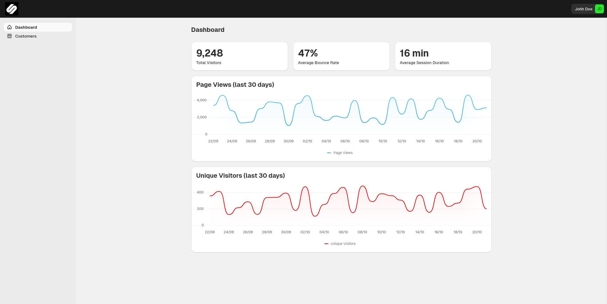

# Sambusa

This is a [Next.js](https://nextjs.org) dashboard that shows user visit data.



## Getting Started

To run this application, you will need [Node.js](https://nodejs.org/en)
installed.

Run the following command to install all the dependencies.

```bash
npm install
```

First, run the development server:

```bash
npm run dev
```

Open [http://localhost:3000](http://localhost:3000) with your browser to see the
result.

## Tech stack

- **[Next.js 14 (App Router)][next]** for the full-stack React framework
- **[Shopify Polaris][polaris]** as the UI component library
- **[Mockaroo][mockaroo]** for sample data (backend)

## Mockaroo

This application uses Mockaroo to get it's data such as customers and visit
statistics. You can find the relevant schemas for each data endpoint here:

- [Customers Schema][mock-customers]
- [Visit Statistics][mock-visit-stats]

The various API endpoints and schema IDs are stored in the `.env` file at the
root of this repository.

[next]: https://nextjs.org/
[polaris]: https://polaris.shopify.com/
[mockaroo]: https://mockaroo.com/
[mock-customers]: https://mockaroo.com/68d94670
[mock-visit-stats]: https://mockaroo.com/f1daff90
